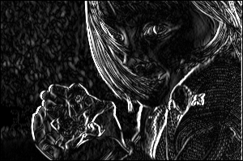
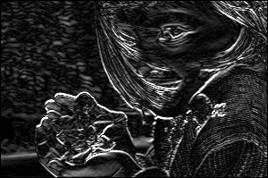
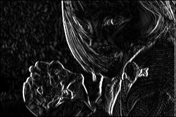
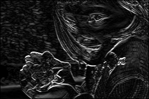
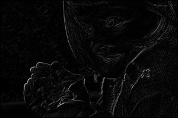
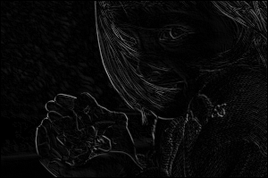

# Edge-detection-Kernels
A variety of kernels exists for operations e.g.,  edge detection, sharpening, and blurring, etc. \
Specifically in edge detection, there are range of different kernels, each offers a unique style of edge detection.

# Kernels
## Sobel
| Original | Vertical | Horizontal |
| :---: | :---: | :---: |
|  |   |  |

## Prewitt
| Original | Vertical | Horizontal |
| :---: | :---: | :---: |
|  |   |  |

## Robert
| Original | Vertical | Horizontal |
| :---: | :---: | :---: |
|  |   |  |
